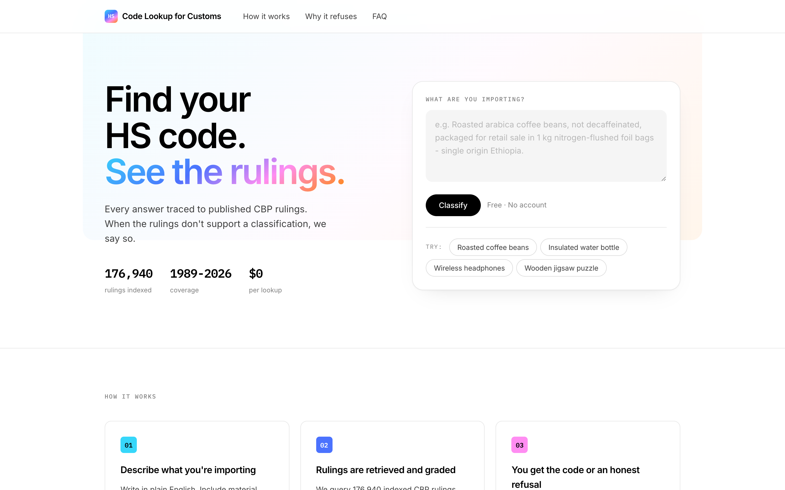
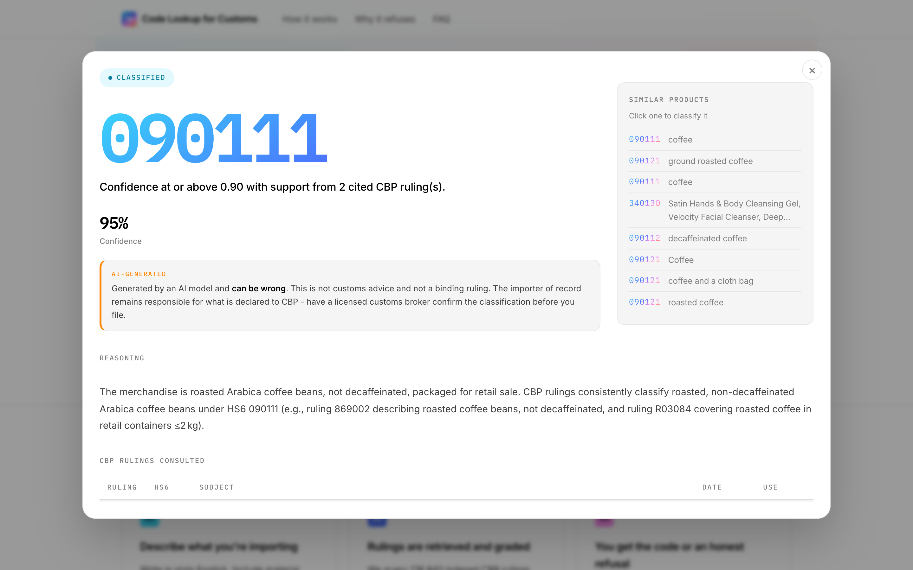
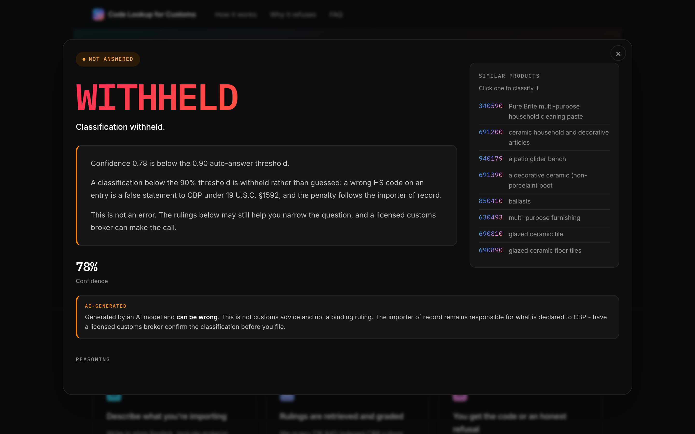
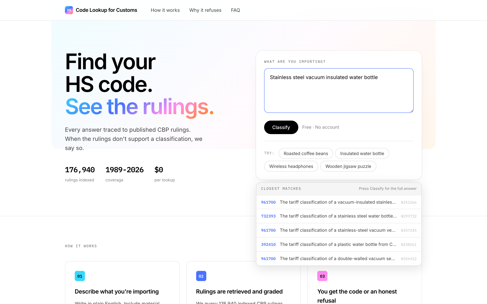
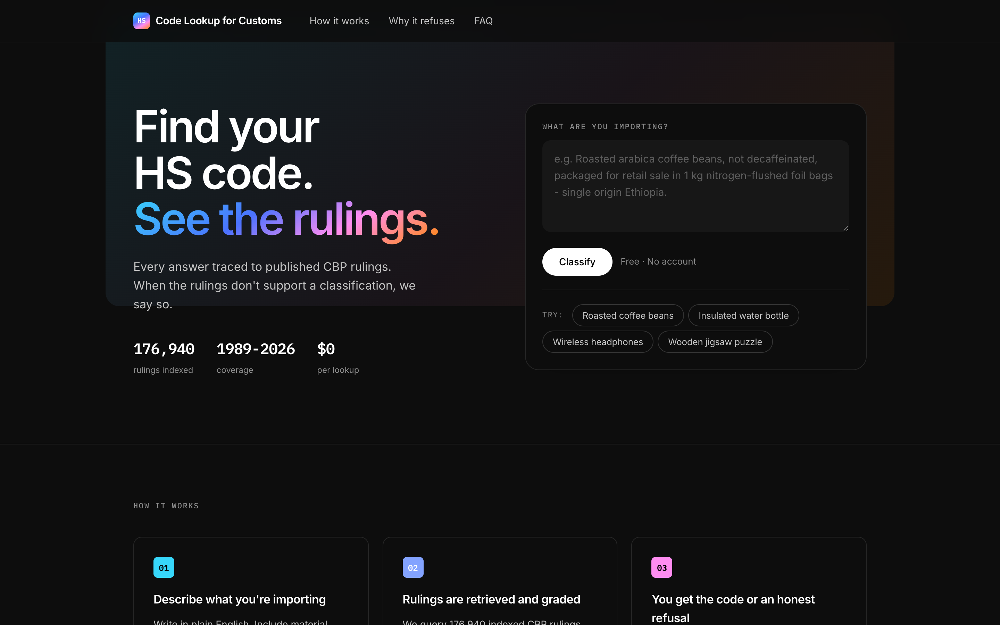

<div align="center">

# HS Code Lookup for Customs

## [hs-code-lookup-dusky.vercel.app](https://hs-code-lookup-dusky.vercel.app)

### Find your HS code. See the rulings behind it.

Every classification traced to the published CBP rulings that support it -<br>
and withheld outright when they don't. Free, no account.

[](LICENSE)
[](https://www.python.org)
[](https://rulings.cbp.gov)
[](#run)
[](https://hs-code-lookup-dusky.vercel.app)

</div>



**176,972 CBP classification rulings, 1989-2026, behind one text box.** Describe your goods and get
a 6-digit HS subheading with every ruling it leaned on named and linked - or a straight refusal when
the rulings don't support one. Seven dependencies, no framework, no build step, no JavaScript
framework, and a corpus you can rebuild yourself from public records.

|                                                              |                                                          |
| :----------------------------------------------------------: | :------------------------------------------------------: |
|                |                |
| **Answered** - the code, the confidence, and neighbouring products one click away | **Withheld** - below threshold, and it says so |
|                   |     |
| **176,972 ruling pages**, each linked to its nearest neighbours | **Live retrieval as you type** - no model call, so it's free |

Every theme value is a CSS custom property with a light and a dark pair, so dark mode is a token
swap that follows the OS - no toggle, no JavaScript, nothing stored.



## Why this exists

A wrong HS code on an entry is a false statement to CBP under 19 U.S.C. §1592. Competitors publish
92-96% accuracy at the 6-digit level and stop there. Nobody sells a classification that is *legally
defensible*: reasoning traced to specific published rulings, with a calibrated gate that declines to
answer rather than guessing. The gate is the product, not a safety feature bolted onto it.

The wedge is CBP CROSS: 200,000+ public rulings, free, deep, owned by nobody, and usable as both the
retrieval corpus and the eval ground truth. Being able to *measure* is the moat.

## Architecture

Transferred node-for-node from the freight exception agent, pointed at a problem where being wrong
has a statutory citation attached.

| Freight agent          | Here                                    |
| ---------------------- | --------------------------------------- |
| `classify_exception`   | `classify.classify`                     |
| `retrieve_playbook`    | `retrieve.search` over CROSS rulings    |
| `decide_authorization` | `classify.gate` - answer vs. escalate   |

Same machinery: a deterministic gate the model cannot talk its way past, one auto-answer threshold
in one place, a labelled fallback instead of a silent one, and a threshold calibrated against
measured accuracy rather than taste.

## Files

| File           | Does                                                                       |
| -------------- | -------------------------------------------------------------------------- |
| `cross.py`     | Crawl rulings.cbp.gov; split each ruling into description + HTS label       |
| `retrieve.py`  | Hybrid dense+sparse retrieval over the corpus, RRF-fused and reranked       |
| `classify.py`  | Classify against retrieved rulings, then apply the gate                     |
| `backtest.py`  | Held-out accuracy and the threshold calibration sweep                       |
| `app.py`       | Lookup page, 177k indexable ruling pages, sitemap, JSON endpoint            |
| `test_hs.py`   | Leakage, gate, retrieval, seeding and sitemap checks                        |
| `static/`      | The whole front end: two HTML templates, one CSS file, self-hosted fonts    |

### Label leakage

The backtest is worthless if the eval input contains its own answer. `cross.extract_description`
cuts each ruling at the first conclusion marker *and* at the first HTS code, which also removes
subheadings the importer proposed and CBP rejected. `backtest.split` removes the held-out rulings
from the index before anything is classified. Both are asserted in `test_hs.py`.

## Run

```bash
python -m venv .venv && .venv/bin/pip install -r requirements.txt
cp .env.example .env          # add GROQ_API_KEY and/or MISTRAL_API_KEY

.venv/bin/python cross.py --from-year 1989 --to-year 2026   # ~177k rulings, ~2h, resumable
.venv/bin/python backtest.py --cases 500                    # the kill switch
.venv/bin/python backtest.py --cases 500 --no-model         # retrieval-only floor
.venv/bin/python -m pytest test_hs.py -q

.venv/bin/python -m uvicorn app:app --port 8099   # the free lookup page
```

## Deploy

The hosted instance runs on Vercel with the index in Qdrant Cloud: the embedded index is 1.1GB and
the corpus 790MB, and neither fits in a 250MB function on a read-only disk. Nothing is deployed but
the code and `static/`, and the app skips seeding entirely when `QDRANT_URL` names a populated
collection.

```bash
python seed_cloud.py                      # one-off: 177k points into the cluster, ~20 minutes
vercel env add QDRANT_URL production      # and QDRANT_API_KEY, GROQ_API_KEY, MISTRAL_API_KEY, BASE_URL
vercel deploy --prod
```

Live at **[hs-code-lookup-dusky.vercel.app](https://hs-code-lookup-dusky.vercel.app)**. Sitemaps are the one thing a hosted
instance does not serve - they are written next to the corpus, which is not deployed.

## The SEO surface

The lookup page is one URL competing against Flexport and Avalara. The corpus is 176,972 URLs
competing against nothing: `/ruling/N352926` is a real page about a real product, titled with the
long-tail phrase someone actually searches ("tariff classification of a hat, a headband and a
blanket from China"). Each one links to the six rulings nearest it in retrieval space, so the corpus
is a connected graph rather than 176,972 orphans, and each links into the lookup tool.

`/sitemap.xml` is an index over `/sitemap-N.xml` parts, because one sitemap is capped at
50,000 URLs and the corpus is well past that; `robots.txt` points at it and keeps `/?q=` lookups out of the
index, since a separate indexable page per query is how a tool becomes thin content. Set `BASE_URL`
in the deployment or every canonical tag will claim the pages live on localhost.

### Providers

Both Groq and Mistral speak the OpenAI chat-completions dialect, so one client covers them and the
only difference is a base URL. Every key configured in `.env` becomes a link in a fallback chain:
all but the last give up after two retries, so a rate-limited provider costs seconds rather than the
run. Which model answered is stamped on every result and reported per-provider, because a chain is
two different models and one blended accuracy number would hide which is doing the work.

`backtest.py` prints ungated HS6/HS4 accuracy, retrieval recall@k (the ceiling on everything else),
and a coverage-vs-precision table across candidate thresholds. Pick the lowest threshold whose
precision clears what an entry filing needs; that number goes in `classify.ANSWER_CONFIDENCE_THRESHOLD`.

## Status

- [x] 1. Repoint retrieval at CROSS
- [ ] 2. Backtest 500 published rulings - **the kill switch**; near 80% means the thesis is wrong
- [x] 3. Free single-lookup page (SEO surface)
- [ ] 4. Stripe-billed API tier

## Scale notes

The corpus is indexed once and cached: `data/qdrant.seed` fingerprints `rulings.jsonl`, so a restart
re-reads neither the 790MB corpus nor the vectoriser. Only a changed corpus triggers a rebuild
(~2-5 minutes for 177k rulings).

Embedded Qdrant warns above roughly 20,000 points and this corpus is nine times that. Point it at a
server when search gets slow:

```bash
docker run -d -p 6333:6333 -v "$PWD/data/qdrant-server:/qdrant/storage" qdrant/qdrant
echo 'QDRANT_URL=http://localhost:6333' >> .env
```

## Licence

MIT - see [LICENSE](LICENSE).

The CBP rulings themselves are US Government public records and are not covered by that licence;
`rulings.jsonl` is not distributed with this repository because it is 790MB and you can rebuild it
from source with `cross.py`. Bundled fonts (Inter, IBM Plex Mono) are SIL OFL 1.1 - see
[`static/fonts/`](static/fonts/).
